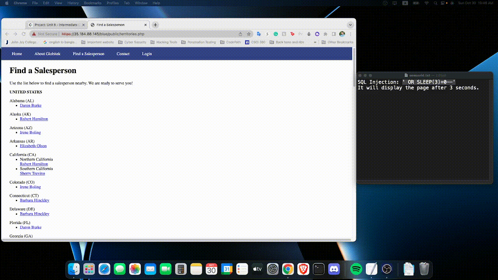
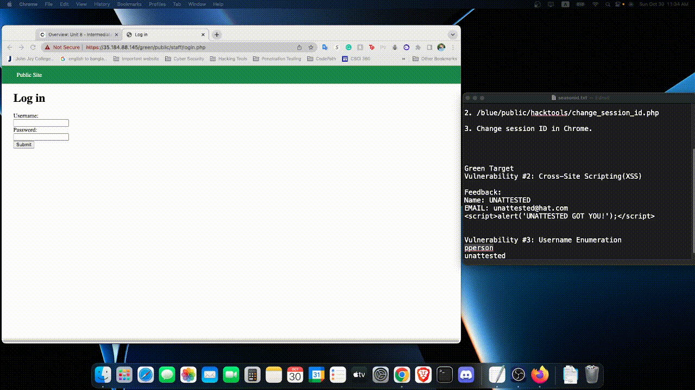
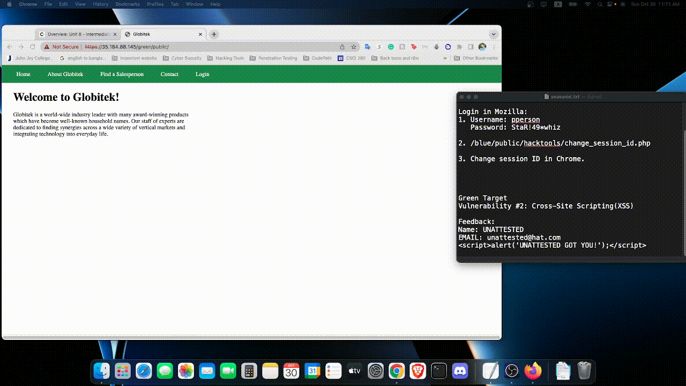
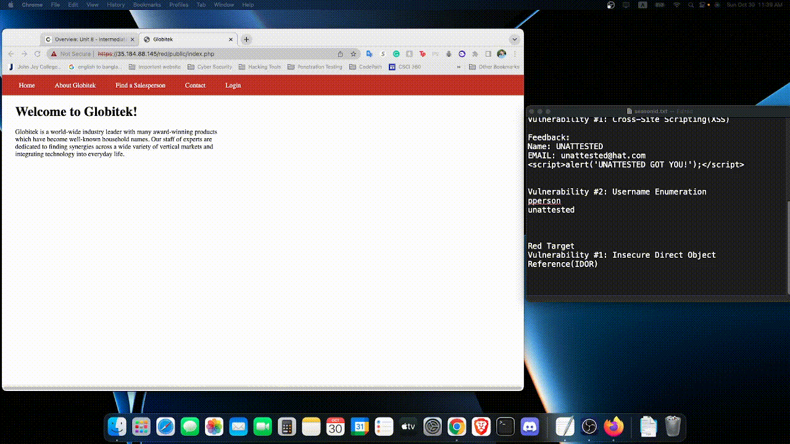

# CodePath_Homework_8

# Pen Testing Live Targets

Time spent: 6 hours spent in total

> Objective: Identify vulnerabilities in three different versions of the Globitek website: blue, green, and red.

The six possible exploits are:

* Username Enumeration
* Insecure Direct Object Reference (IDOR)
* SQL Injection (SQLi)
* Cross-Site Scripting (XSS)
* Cross-Site Request Forgery (CSRF)
* Session Hijacking/Fixation

Each color is vulnerable to only 2 of the 6 possible exploits. First discover which color has the specific vulnerability, then write a short description of how to exploit it, and finally demonstrate it using screenshots compiled into a GIF.

## Blue

Vulnerability #1: Session Hijacking/Fixation

Description: To get Session ID, I used two different browser, Mozilla Firefox was used to login and get the session id. 
```
Username: pperson
Password: StaR!49*whiz
 ```

Then I have to use a php code that just need to added in the url. And copy the session id.
```
/blue/public/hacktools/change_session_id.php
```
After get the session id from Mozilla firefox, then I went to the chrome and change my session id with the same above url. Then after refresh I can sucessfully login in the blue.


Vulnerability #2: SQL Injection (SQLi)

Description: For sql injection I use the following injection in the url after the id=. That will display the page after 3 seconds. 
```
' OR SLEEP(3)=0--'
```





## Green

Vulnerability #1: Username Enumeration

Description: If i used the correct username and wrong password, it shows "Log in was unsuccessful" but this letter shows in a bold format.
But if we use the wrong username and wrong password, "Log in was unsuccessul" was normal format. This is the vulnerability for username enumeration. 




Vulnerability #2: Cross-Site Scripting (XSS)

Description: This the cross-site scripting. After successfully inject a HTML code it popup when someone open this page. 
```
Name: UNATTESTED
EMAIL: unattested@hat.com
<script>alert('UNATTESTED GOT YOU!');</script>
```




## Red

Vulnerability #1: Insecure Direct Object Reference (IDOR)

Description: We can modily the value in the url to get some information that we are not suppose to see this. There I found, user 10, and 11 is not suppose to see. But IDOR makes us to see those employee's information. 




Vulnerability #2: Cross-Site Request Forgery (CSRF)

Description: Here we build a html code based on the codepath's documentation https://guides.codepath.com/websecurity/Cross-Site-Request-Forgery 
Then use the phishing attack, send the link for this malicious code, and after someone click on this link, it will add a new username and other credential in their database. 
```
Name: UNATTESTED
Email: unattested@hat.com
FeedBack: Pay your parking ticket at 
/Users/mdislam/Downloads/CodePath/Week8/index.html
```


