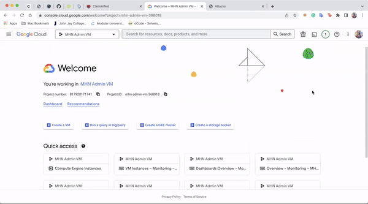
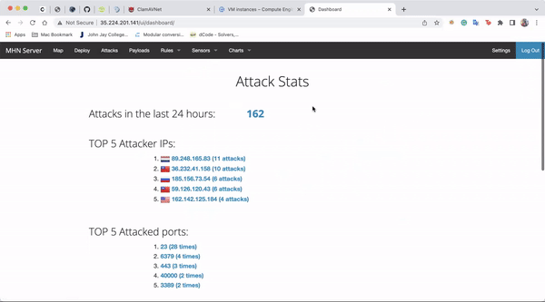

# Project 9 - Honeypot

Time spent: **30** hours spent in total

- [x]	Milestone 0: To the Cloud!

- [x]	Milestone 1: Create MHN Admin VM

- [x] Milestone 2: Install the MHN Admin Application

- [x] Milestone 3: Create a MHN Honeypot VM

- [x] Milestone 4: Install the Honeypot Application

- [x] Milestone 5: Attack!

### Demo on creating a MHN Honeypot

### Which Honeypot(s) you deployed
1. dionaea with HTTP(80)

  
### Any issues you encountered
The hardest part of this entire lab is setting up the honeypot in GCP.

### Attack Summary

**number of attacks until the server close : 643

**Top 5 Attacker IPs:** 
1. 89.248.165.83 (37 attacks)
2. 89.248.165.206 (29 attacks)
3. 114.239.117.102 (14 attacks)
4. 102.159.252.5 (13 attacks)
5. 60.250.1.100 (12 attacks)

**Top 5 Attacked Ports:**
1. 23 (134 times)
2. 5060 (16 times)
3. 6379 (14 times)
4. 1433 (13 times)
5. 80 (8 times)

### Any unresolved questions raised by the data collected
None as of right now.

### References

https://courses.codepath.org/courses/cyb102/unit/9#!project

https://drive.google.com/file/d/1JBZWnx9la6l97v63-_-EwxeE9kD4ygs8/view

Copyright [2022] [Md Jayadul Islam]
